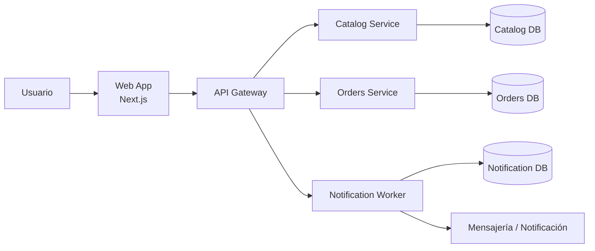

# Wiki de MileShop Platform

## Propósito

Esta wiki documenta la arquitectura, la operación, el flujo de trabajo y la calidad requerida para construir y sostener MileShop Platform como un sistema profesional, reproducible y mantenible.

No es una guía genérica. Está pensada para reflejar la realidad del proyecto y convertir decisiones técnicas en conocimiento compartido.

## ¿Cuál es la función de esta wiki?

La wiki responde a cuatro preguntas fundamentales:

1. ¿Qué sistema estamos construyendo?
2. ¿Cómo está organizado por dominios y servicios?
3. ¿Qué estándares técnicos y operativos exige cada cambio?
4. ¿Cómo se entrega, valida y sostiene la aplicación en producción?

## Mapa rápido del contenido

- [Arquitectura y diseño](architecture-overview.md)
- [Estándares de ingeniería](engineering-standards.md)
- [Plan de versión 1.0.0](../PLAN-V1-2026.md)
- [Release playbook](../RELEASE-PLAYBOOK.md)
- [Operación del stack](../STACK_OPERATIONS.md)

## Visión general del sistema

## Principios de diseño

- cada servicio posee su propio dominio y su propia responsabilidad;
- la integración ocurre por contratos explícitos y versionados;
- la base de datos no se comparte entre dominios;
- la calidad se valida antes del merge;
- la operación debe ser reproducible y auditable;
- el código debe poder ser soportado por otra persona sin dependencia de la memoria del autor.

## Cómo usar esta wiki

- comenzar por la arquitectura;
- luego revisar la calidad y estándares;
- luego revisar el proceso de release y operaciones;
- usar el plan de v1 como referencia para entregas reales.

## Regla de mantenimiento

Cada cambio importante del sistema debe reflejarse aquí:

- nueva decisión de arquitectura;
- cambio de dominio o contrato;
- cambio de flujo operativo;
- ajuste de quality gates;
- cambio de release procedure.

Si un proceso no está documentado, no se puede considerar robusto.
