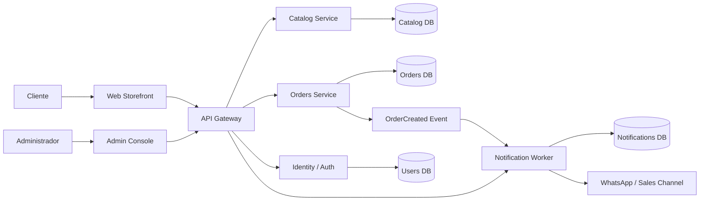

# Wiki técnica de MileShop Platform

## 1. Propósito

Esta wiki documenta la realidad técnica y funcional del sistema que estamos construyendo: una plataforma de catálogo comercial con flujo de compra, registro obligatorio, administración editorial y atención comercial por WhatsApp.

No es una wiki de estilo genérico ni un repositorio de frases vacías. Su función es dejar documentado el modelo de negocio, la estructura del sistema, las decisiones de arquitectura y los estándares que sostienen la plataforma en producción.

## 2. Qué responde esta wiki

Esta wiki responde a estas preguntas:

1. ¿Qué negocio está soportando la plataforma?
2. ¿Qué actores intervienen y qué hacen?
3. ¿Cómo funciona el flujo de catálogo, registro y compra?
4. ¿Cómo está organizada la arquitectura por dominios y servicios?
5. ¿Qué estándares técnicos, de calidad y operación deben cumplirse?
6. ¿Qué decisiones no pueden cambiarse sin afectar el modelo del negocio?

## 3. Cobertura del conocimiento

- [architecture-overview.md](architecture-overview.md) — arquitectura del sistema, flujos del negocio y diagrama de dominio
- [engineering-standards.md](engineering-standards.md) — principios SOLID, quality gates y estándares de ingeniería
- [../PLAN-V1-2026.md](../PLAN-V1-2026.md) — roadmap y criterios de entrega para la v1
- [../RELEASE-PLAYBOOK.md](../RELEASE-PLAYBOOK.md) — release, hotfix y rollback
- [../STACK_OPERATIONS.md](../STACK_OPERATIONS.md) — runtime, ownership y operación del stack
- [../LOCAL_STACK_RUNBOOK.md](../LOCAL_STACK_RUNBOOK.md) — ejecución local y smoke tests

## 4. Sistema a construir

## 5. Diagramas que forman la base del proyecto

La wiki debe mantener explícitamente estos diagramas y modelos:

- diagrama de actores y casos de uso;
- diagrama de flujo del cliente;
- diagrama de flujo del administrador;
- diagrama de secuencia de compra;
- diagrama de componentes;
- diagrama de entidades y relaciones;
- diagrama de estado del pedido;
- diagrama de dependencias por servicio;
- diagrama de contexto del sistema.

## 6. Regla de mantenimiento

Cada cambio de negocio, flujo, servicio o contrato debe reflejarse aquí.

Esto incluye:

- nuevas categorías o reglas de merchandising;
- cambios en datos del cliente requeridos para compra;
- nuevas promociones, descuentos o destacables;
- cambios en el estado del pedido;
- nueva integración con WhatsApp u otros canales;
- cambios de contrato entre servicios;
- cambios de runtime, release o operación.

Si la decisión no está documentada, no se puede considerar resuelta.

## 7. Principios del proyecto

- cada dominio tiene ownership claro;
- el catálogo no comparte estado con el pedido;
- la compra requiere contexto real del cliente;
- los precios visibles deben ser los precios pactados;
- la administración editorial y comercial son parte del sistema;
- la notificación por WhatsApp es un canal operativo y no un detalle secundario;
- el código debe describir el negocio, no al revés;
- la documentación es parte del producto, no un apéndice.

## 8. Criterio de uso

Esta wiki debe leerse en este orden:

1. arquitectura general;
2. flujos del negocio;
3. estándares y principios;
4. roadmap y entregables v1;
5. operación y release;
6. decisiones técnicas a medida que el proyecto madura.

## 9. Conclusión

MileShop Platform no es una tienda trivial. Es un sistema que combina catálogo, ventas, identidad del cliente, autoridad editorial y atención comercial. La wiki existe para dejar esos límites, flujos y decisiones explícitos y para que el proyecto pueda crecer sin perder claridad ni calidad.
