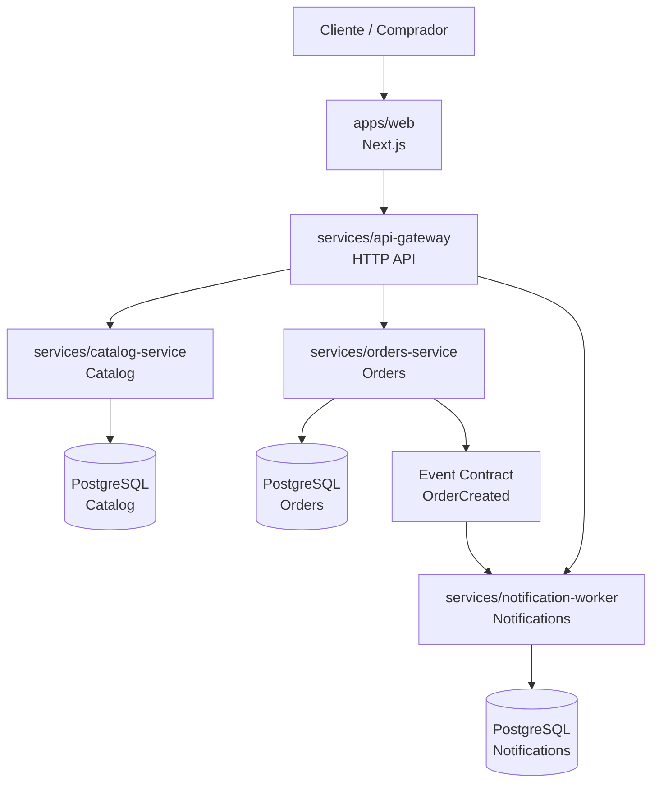

# Arquitectura y diseño

## 1. Objetivo del sistema

MileShop Platform tiene como objetivo ofrecer una experiencia de compra digital basada en un modelo distribuido y claro por dominios, con un frontend de usuario, un gateway de composición y servicios especializados por responsabilidad de negocio.

La estrategia principal no es un monolito funcional oculto, sino un conjunto de bounded contexts con propiedad clara de datos, lógica y despliegue.

## 2. Modelo de arquitectura

## 3. Responsabilidades por capa

### Frontend

Responsable de la experiencia del usuario y de la capa de presentación.

- catálogo y navegación;
- carrito y checkout;
- feedback visual del estado del pedido;
- consumo de los servicios a través del gateway.

### API gateway

Responsable de composición y coordinación de entrada pública.

- expone endpoints públicos para clientes;
- orea la composición de llamadas a servicios internos;
- centraliza manejo de errores y fallos de dependencia;
- expone health checks y estado del sistema.

### Catalog service

Responsable del catálogo y sus metadatos.

- obtener productos activos;
- sostener los datos del catálogo;
- exponer información de disponibilidad y precios;
- mantener un contrato estable para consumo por parte del gateway y el frontend.

### Orders service

Responsable de la lógica de pedido y validación del dominio.

- crear ordenes con validación de reglas de negocio;
- construir el dominio del pedido;
- emitir eventos versionados para integraciones;
- mantener la persistencia del pedido como dato de dominio.

### Notification worker

Responsable de la reacción a eventos del sistema.

- procesar eventos publicados por otros servicios;
- deduplicar mensajes y reintentos;
- enviar notificaciones a canales externos;
- mantener idempotencia sobre eventos repetidos.

## 4. Principios de diseño aplicados

### Ownership
Cada dominio es responsable de su propio estado.

### Bounded context
El catálogo no necesita conocer las órdenes, ni viceversa.

### Contract versioning
Toda integración y evento debe llevar versionado explícito.

### Single responsibility
Cada servicio resuelve una intención de negocio, no varias.

### Resilience
Cada servicio debe degradar con gracia cuando otra dependencia falle.

## 5. Flujo principal de negocio

### Flujo de compra

1. el usuario consulta el catálogo;
2. el frontend envía la selección al carrito;
3. el checkout prepara el resumen del pedido;
4. la orden se crea a través del gateway y el orders service;
5. el orders service publica el evento relevante;
6. el notification worker consume el evento y entrega la notificación;
7. la UX confirma la compra al usuario.

## 6. Consideraciones de diseño

### Datos compartidos
No se comparten tablas ni modelos de dominio entre servicios.

### Integración
La integración se hace por HTTP o eventos por contrato, no por acceso directo a datos ajenos.

### Observabilidad
Cada servicio debe aportar health checks, logs y trazabilidad mínima para diagnóstico.

### Seguridad
No se versionan secretos, no se publican tokens ni claves, y la configuración debe ser explícita por entorno.

## 7. No objetivos

- no crear un monolito funcional camuflado;
- no mezclar estados de diferentes dominios en un mismo servicio;
- no centralizar la base de datos del negocio como solución “rápida”;
- no entregar una plataforma sin pruebas, rollback y observabilidad.

## 8. Conclusión

La arquitectura de MileShop Platform está pensada para crecer sin convertir el proyecto en una dependencia imposible de sostener. La clave es claridad de dominio, separación de responsabilidad y rigor operativo.
