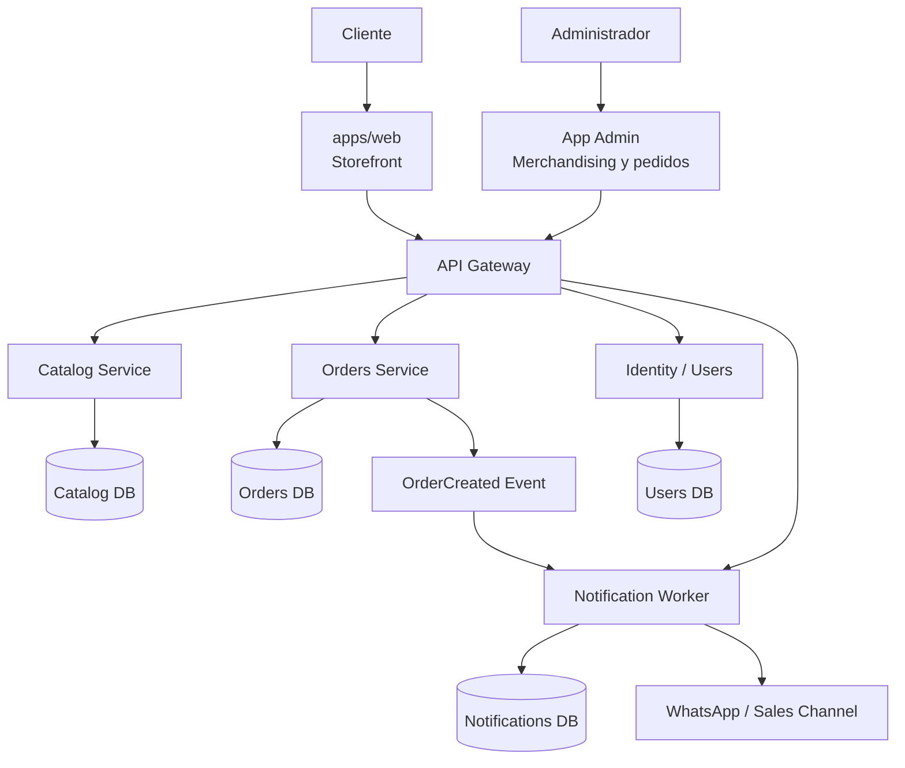
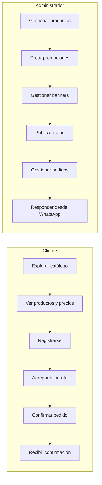
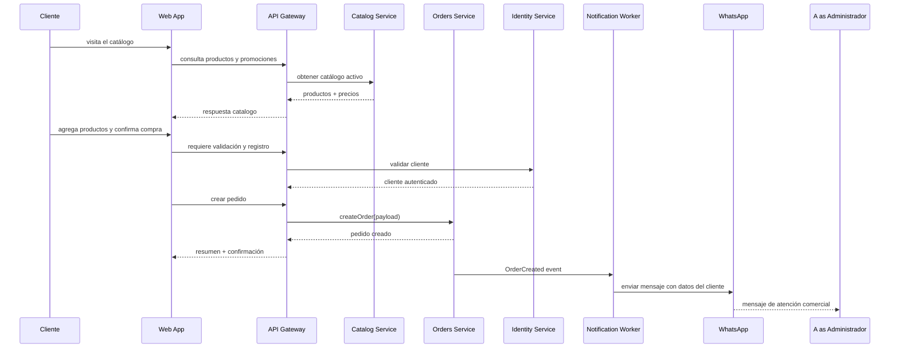
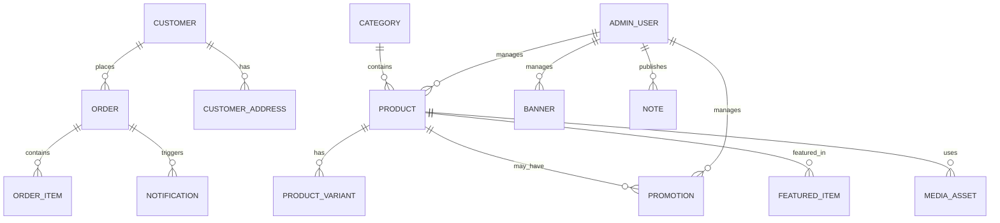
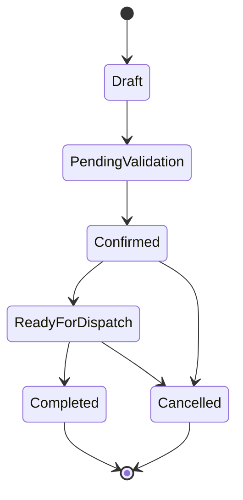
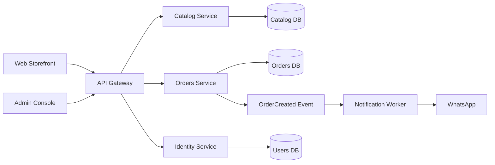

# Arquitectura y diseño

## 1. Objetivo del sistema

MileShop Platform está pensado como una plataforma de comercio digital orientada a catálogo, registro obligatorio, compra por pedido y atención comercial mediante WhatsApp. No es una tienda genérica ni una demo de ecommerce. Es una solución de venta con fuerte componente de merchandising, gestión editorial y control comercial.

La arquitectura está diseñada para separar claramente:

- presentación web;
- catálogo y merchandising;
- pedidos y validación de negocio;
- identidad del cliente;
- notificaciones y canales externos;
- administración operativa del contenido y del negocio.

La base de diseño es la separación por dominios, sin compartir bases de datos ni lógica de negocio entre servicios.

## 2. Contexto de negocio

El sistema debe soportar dos tipos de actores principales:

- cliente: navega, consulta precios pactados, se registra y realiza pedidos;
- administrador: crea y gestiona productos, promociones, banners, publicaciones, descuentos y pedidos.

El negocio no se limita a “vender producto”. Incluye también:

- catalogación y organización por categorías;
- relevancia editorial del catálogo;
- gestión comercial con promociones y descuentos;
- visualización de imágenes, banners y publicaciones;
- compra con registro previo y validación de datos del cliente;
- notificación de la compra a la empresa por WhatsApp con contexto útil para atención.

## 3. Diagrama de contexto del sistema

## 4. Casos de uso del negocio

## 5. Actores y responsabilidades

### 5.1 Cliente

Debe poder:

- ver el catálogo organizado por categorías;
- identificar productos relevantes, destacados y promocionados;
- consultar precio pactado y disponible;
- registrarse con datos completos antes de comprar;
- adoptar el flujo de compra con contexto real del cliente;
- recibir confirmación y seguimiento del proceso.

### 5.2 Administrador

Debe poder:

- crear, editar, pausar y eliminar productos;
- organizar categorías y variantes;
- definir precios, promociones y descuentos;
- gestionar banners, publicaciones y productos destacados;
- revisar pedidos y estados;
- mantener la parte editorial del negocio;
- responder al cliente con contexto real del pedido.

## 6. Dominio funcional principal

### 6.1 Catálogo y merchandising

Responsable de:

- categorías;
- productos;
- imágenes;
- variantes;
- precios;
- promociones;
- destacados;
- descuentos;
- carruseles y banners;
- publicaciones / notas relevantes.

### 6.2 Pedidos y checkout

Responsable de:

- carrito;
- líneas del pedido;
- validación de reglas de negocio;
- total y cantidades;
- estado del pedido;
- trazabilidad del proceso;
- emisión de eventos para integración.

### 6.3 Usuarios y registro

Responsable de:

- identidad del cliente;
- perfiles;
- contacto y ubicación;
- historial de compras;
- permisos y acceso;
- cumplimiento de reglas de registro previo a compra.

### 6.4 Notificaciones y comercial

Responsable de:

- eventos del sistema;
- deduplicación de mensajes;
- notificaciones de pedido o confirmación;
- integración con WhatsApp o canal externo.

## 7. Flujo real de compra

## 8. Reglas de negocio clave

Estas reglas deben quedar formalizadas y no como suposiciones vagas:

1. El cliente debe estar registrado antes de realizar un pedido.
2. Los precios visibles deben ser precios pactados o vigentes por catálogo.
3. Un producto o variante puede estar promocionado, destacado o descontado, pero eso debe quedar explícito.
4. Los banners, destacados y publicaciones deben ser gestionados por administración editorial.
5. El pedido debe incluir datos del cliente para permitir atención comercial en WhatsApp.
6. El mensaje enviado al negocio debe contener contexto suficiente para identificar al comprador y su compra.
7. El administrador debe gestionar productos, promociones, visual merchandising y pedidos desde un panel seguro.
8. El sistema debe conservar trazabilidad suficiente para soportar seguimiento, revisión y reversión.

## 9. Diagrama de entidades y relaciones

## 10. Diagrama de estado del pedido

## 11. Diagrama de dependencias por servicio

## 12. Principios de diseño aplicados al caso real

### Ownership por dominio
- catalog service owns catalog data;
- orders service owns order lifecycle;
- users identity owns customer context;
- notification worker owns outbound communication.

### Acoplamiento mínimo
El catálogo no debe depender de la lógica de pedido. El pedido no debe depender de detalles internos de merchandising.

### Eventos versionados
OrderCreated y otros eventos de integración deben ser contract-first y versionados.

### Seguridad del dato
Los datos del cliente deben manejarse con reglas claras de privacidad, acceso y trazabilidad.

### Observabilidad
Todo flujo significativo debe dejar trazas útiles para diagnóstico de compra, notificación y estado del pedido.

## 13. Arquitectura de capas recomendada

### Capa de presentación
- storefront web;
- admin console;
- UX de catálogo y checkout.

### Capa de aplicación
- API gateway;
- orquestación;
- validación de acciones del cliente;
- coordinación entre servicios.

### Capa de dominio
- reglas del producto;
- reglas de pricing;
- reglas del pedido;
- política de notificación.

### Capa de infraestructura
- persistencia;
- mensajería externa;
- archivos e imágenes;
- transporte de eventos;
- monitoring y operación.

## 14. No objetivos ni decisiones a evitar

- no centralizar la base de datos del negocio en una sola BD;
- no mezclar catálogo, usuarios y pedidos en un mismo servicio por comodidad;
- no tratar la notificación como un feature opcional; es parte del flujo de venta;
- no permitir que el cliente compre sin un contexto mínimo de identidad y contacto;
- no ocultar el precio con lógica no documentada;
- no dejar contenido y promociones sin ownership administrativo claro.

## 15. Conclusión

MileShop no es un e-commerce abstracto: es un sistema de catálogo comercial con registro de cliente, venta orientada a pedido, administración del merchandising y atención comercial por WhatsApp. Por eso la arquitectura debe reflejar claramente ese modelo de negocio.

La clave no es “tener muchos servicios”, sino tener dominios reales con intención clara, contratos explícitos y una operación soportable.
